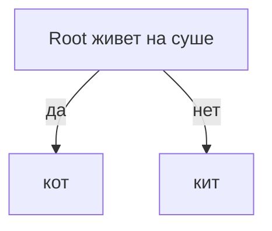
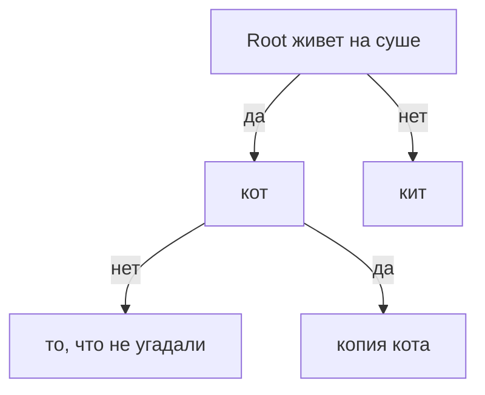

# Приложение с угадыванием животного.

Привет! Это приложение позволяет угадывать животного по наводящим вопросам.

# Алгоритм

Имеется класс Node, который является основной составляющей структуры типа дерева. В классе TreeTraversalImpl реализованы методы обход по одной ноде traverseNode, обход по одной ноде до конца traverseNodeToTheEnd и обход всего дерева traverseFullTree, что в итоге позволяет реализовать функционал игры.

Изначальное состояние игры выглядит так:

Так как в классе Node имеется поле hasNext, то по нему можно определять, есть ли дальше еще ноды(узлы и тд).

После того, как мы ответили, что, допустим, это не кот, то произойдет добавление ноды. 

Так выглядит структура после добавления новой ноды.

## Что можно было бы улучшить

1. Добавить бд и хранить там ноды.
2. Доделать до веб-приложения.
3. Улучшить сложность алгоритма поиска совпадения животных.

## Проекты со Spring Boot, Kafka, Postgresql и тд можно посмотреть в моем профиле в репозиториях neoflex/*/ (ветки не мерджил, так как были такие условия проверки с пулл реквестом)
## Спасибо за просмотр этого репозитория! 
